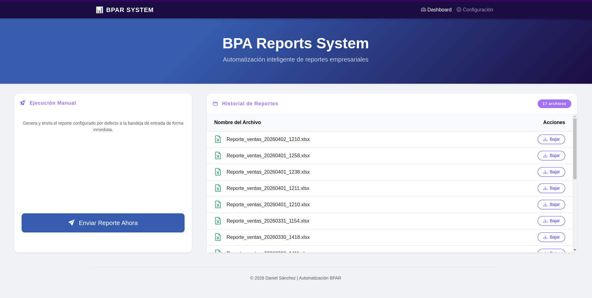
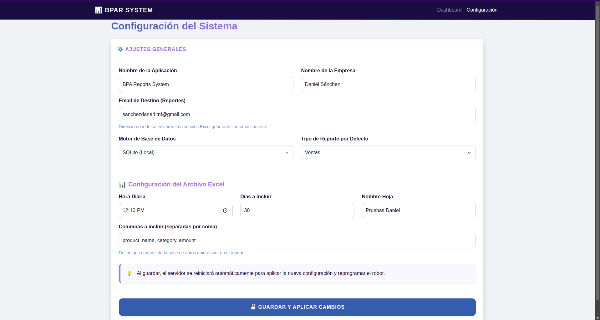
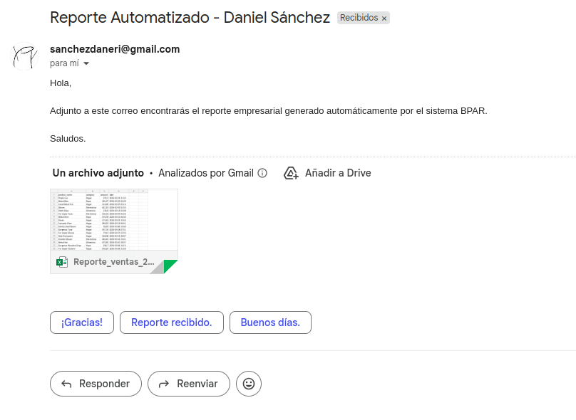
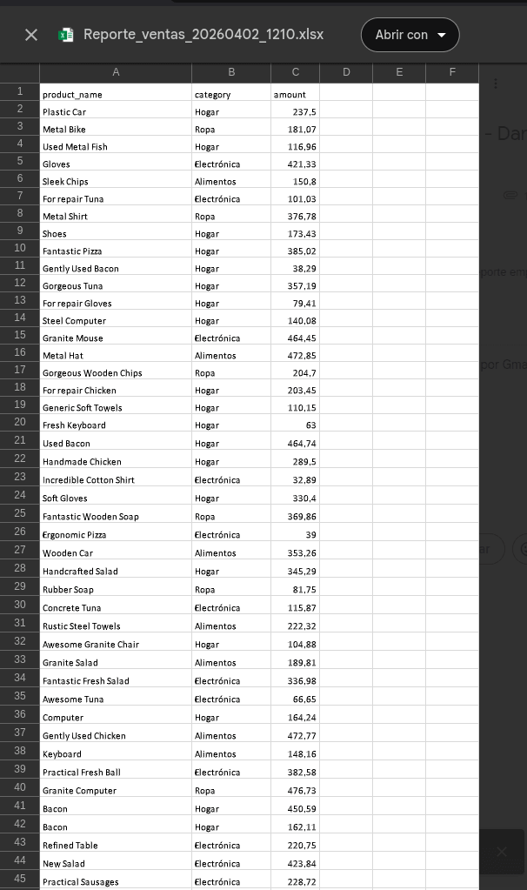

# 📊 Business Process Automation Reports (BPAR)


Sistema **Full-Stack** de automatización para la generación de distribución de reportes empresariales.
Transforma datos crudos en informes profesionales (Excel) y los gestiona de forma autónoma o bajo demanda mediante uan interfaz web moderna.

---

## 🚀 Descripción

BPAR es una solución integral diseñada para eliminar el trabajo manual de reporting. El sistema automatiza el ciclo completo:
- **Extracción:** Consulta dinámica a bases de datos (SQLite/PostgreSQL).
- **Procesamiento:** Transformación de datos y cálculo de métricas con **Pandas**.
- **Generación:** Diseño de archivos Excel profesionales con **Openpyxl**.
- **Distribución:** Envío automático por **Email (SMTP)** con archivos adjuntos.
- **Gestión Web:** Interfaz web para configurar el sistema sin tocar una sola línea de código.

---

## ✨ Funcionalidades

✅ **Dashboard Web:** Visualización del historial de reportes y descarga directa.
✅ **Panel de Configuración:** Control total sobre emails, horarios, columnas del Excel y motor de la base de datos desde el navegador.
✅ **Automatización 24/7:** Robot programador (Scheduler) para envíos desatendidos.  
✅ **Ejecución On-Demand:** Disparador manual de reportes con feedback en tiempo real. 
✅ **Persistencia Dinámica:** El sistema detecta cambios en la configuración y se reinicia automáticamente.

---

## 📸 Capturas de Pantalla

### 🖥️ Dashboard Principal
Gestión de reportes generados y ejecución manual en un solo clic.


### ⚙️ Panel de Configuración
Control total de los parámetros del sistema (Email, Horarios, Columnas).


### 📧 Entrega de Reportes
Ejemplo del reporte recibido por email y vista del archivo Excel generado.



---

## 🏗️ Arquitectura del Sistema

El sistema utiliza una arquitectura desacoplada donde el núcleo de datos es independiente de la interfaz de usuario.

### 🔵 Flujo de Trabajo
```text
[ Usuario ] <───► [ Dashboard/Settings ] <───► [ FastAPI ]
                           │                        │
                           ▼                        ▼
[settings.json] ◄─── [ Pydantic Core ] ◄─── [ Background Tasks ]
      │                    │                        │
      ▼                    ▼                        ▼
[ DB SQL ] ───► [ Pandas Engine ] ───► [ Excel ] ───► [ Email SMTP ]
```

### 📂 Estructura del Proyecto
```text
├── app/
│   ├── main.py            # Punto de entrada: Dashboard, API y Panel de Ajustes
│   ├── config.py          # Cerebro de configuración (Pydantic + Dotenv)
│   ├── database.py        # Conexión dinámica (Switch SQLite/Postgres)
│   ├── models.py          # Definición de tablas de la Base de Datos
│   ├── services/          # 🧠 Lógica de Negocio (Servicios)
│   │   ├── report_service.py    # Extracción y filtros de datos
│   │   ├── email_service.py     # Protocolo SMTP y envío de adjuntos
│   │   └── scheduler_service.py # Robot programador de tareas (cron)
│   ├── utils/             # 🛠️ Herramientas de soporte
│   │   └── excel_generator.py   # Motor de diseño y formato de Excel
│   ├── templates/         # 📄 Vistas HTML (Jinja2)
│   │   ├── index.html           # Dashboard principal e historial
│   │   └── settings.html        # Formulario de configuración web
│   └── static/            # 🎨 Archivos Estáticos
│       └── css/
│           └── style.css        # Estilos visuales del sitio (CSS)
├── config/
│   └── settings.json      # Ajustes de usuario persistentes (JSON)
├── data/
│   └── business_data.db   # Base de datos local autogenerada (SQLite)
├── reports/               # Carpeta de almacenamiento de archivos .xlsx
├── tests/                 # 📂 Suite de Pruebas y Verificación
│   ├── test_config.py           # Valida carga de .env y settings.json
│   ├── test_report.py           # Valida generación física de Excel
│   ├── test_full_flow.py        # Valida flujo manual: DB -> Excel -> Email
│   └── test_scheduler.py        # Valida autonomía del robot (cada minuto)
├── docs/                  # 📸 Documentación y Capturas de pantalla
├── .env.example           # Plantilla de secretos para nuevos usuarios
├── .gitignore             # Filtro de archivos para no subir a Git
├── seed_data.py           # Script para poblar la DB con datos iniciales
├── run.sh                 # Script de arranque rápido con autorecarga
├── requirements.txt       # Listado de dependencias del sistema
└── README.md              # Documentación técnica del proyecto
```
### 🛠️ Tecnologías Utilizadas
- **Backend:** FastAPI, SQLAlchemy, Pydantic, APScheduler.
- **Data:** Pandas, Openpyxl.
- **Frontend:** Jinja2, Bootstrap5, JavaScript.
- **Seguridad:** Dotenv, Python-Multipart, Watchfiles.

### ⚙️ Instalación y Uso

**1. Preparar entorno:**
```Bash
python -m venv venv
source venv/bin/activate  # En Windows: venv\Scripts\activate
pip install -r requirements.txt
```
**2. Configurar Secretos:**

- Copia `.env.example` a `.env.`

- Rellena tus credenciales de Email (Password de aplicación) y Base de Datos.

**3. Poblar Base de Datos e iniciar:**

```Bash
python seed_data.py
uvicorn app.main:app --reload --reload-include "*.json" --reload-include "*.html" --reload-include "*.css" --port 8000
```

**5. Ejecutar:**
```bash
./run.sh
```

**4. Acceso:**

- **Dashboard:** `http://localhost:8000`
- **Ajustes:** `http://localhost:8000/settings` 

---
## 📓 Notas de Desarrollo
Este proyecto se desarrolló en 8 días, cubriendo desde la arquitectura de la base de datos hasta la creación de un panel de administración web dinámico, aplicando principios de código limpio y escalabilidad.

build: versión final 1.0.0 estable