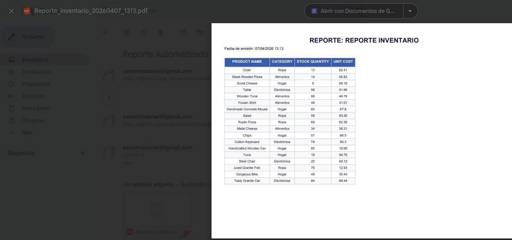

# 📊 Business Process Automation Reports (BPAR)


Sistema **Full-Stack** de automatización para la generación de distribución de reportes empresariales.
Transforma datos crudos en informes profesionales y los gestiona de forma autónoma o bajo demanda mediante una interfaz web moderna y reactiva.

---

## 🚀 Descripción

BPAR es una solución integral diseñada para eliminar la carga operativa manual en la gestión de datos. El sistema automatiz ael ciclo completo del reporte:
- **Extracción:** Consulta dinámica a múltiples tablas (Ventas, Inventario) en bases de datos SQL.
- **Procesamiento:** Transformación de datos y cálculo de métricas con **Pandas**.
- **Generación Multiformato:** Creación de archivos **Excel (.xlsx)** con Openpyxl y **PDF (.pdf)** con ReportLab.
- **Distribución:** Envío automático por **Email (SMTP)** con adjuntos.
- **Gestión Web:** Interfaz para configurar el sistema, seleccionar columnas mediante checkboxes y gestionar el historial.

---

## ✨ Funcionalidades

✅ **Soporte Multiformato:** Generación de reportes en Excel para análisis de datos o PDF para presentaciones ejecutivas.  
✅ **Dashboard Inteligente:** Historial ordenado cronológicamente con iconos visuales diferenciados por tipo de archivo.  
✅ **Configuración Dinámica:** Selección de columnas mediante checkboxes que se actualizan automáticamente según la tabla elegida.  
✅ **Lógica de Interfaz:** Formulario inteligente que oculta parámetros irrelevantes (como el nombre de la hoja en PDF).  
✅ **Notificaciones Real-time:** Sistema de mensajes Flash (Toasts) con feedback inmediato tras confirmar el envío del email.  
✅ **Automatización 24/7:** Robot programador (Scheduler) integrado para envíos desatendidos en horarios específicos.  
✅ **Arquitectura Multi-DB:** Conector flexible compatible con **SQLite** (desarrollo) y **PostgreSQL** (producción).

---

## 📸 Capturas de Pantalla

### 🖥️ Dashboard Principal
Gestión centralizada con iconos dinámicos para PDF/Excel y sistema de notificaciones.


### ⚙️ Panel de Configuración
Control total con lógica condicional para ocultar campos y selección dinámica de columnas.


### 📧 Entrega de Reportes
Ejemplo de recepción de reporte mediante protocolo SMTP, garantizando la distribución inmediata.


### 📊 Resultado Profesional
Vista del reporte PDF generado automáticamente con diseño corporativo y optimización de lectura.


---

## 🏗️ Arquitectura del Sistema

El sistema utiliza una arquitectura desacoplada donde el núcleo de datos es independiente de la interfaz de usuario.

### 🔵 Flujo de Trabajo
```text
[ Usuario ] <───► [ Dashboard/Settings ] <───► [ FastAPI ]
                           │                        │
                           ▼                        ▼
[settings.json] ◄─── [ Pydantic Core ] ◄─── [ Background Tasks ]
      │                    │                        │
      ▼                    ▼               ┌────────┴────────┐
[ DB SQL ] ───► [ Pandas Engine ] ───► [ Excel Generator ] o [ PDF Generator ]
                                           └────────┬────────┘
                                                    ▼
                                             [ Email SMTP ]
```

### 📂 Estructura del Proyecto
```text
├── app/
│   ├── main.py            # Punto de entrada: API, Rutas Web e Historial cronológico
│   ├── config.py          # Cerebro de configuración y validación (Pydantic)
│   ├── database.py        # Conexión dinámica (Switch SQLite/Postgres)
│   ├── models.py          # Definición de modelos de negocio (Sales, Inventory)
│   ├── services/          # 🧠 Lógica de Negocio
│   │   ├── report_service.py    # Procesamiento multireporte y filtros de fecha
│   │   ├── email_service.py     # Envío de correos SMTP asíncronos
│   │   └── scheduler_service.py # Robot programador (APScheduler)
│   ├── utils/             # 🛠️ Generadores de Archivos
│   │   ├── excel_generator.py   # Motor de diseño Excel
│   │   └── pdf_generator.py     # Motor de diseño PDF (ReportLab)
│   ├── templates/         # 📄 Vistas HTML (Jinja2)
│   │   ├── index.html           # Dashboard principal con Toasts y JS dinámico
│   │   └── settings.html        # Configuración con lógica condicional
│   └── static/            # 🎨 Archivos Estáticos
│       └── css/
│           └── style.css        # Identidad visual Tech (Deep Navy & Violet)
├── config/
│   └── settings.json      # Ajustes de usuario persistentes (JSON)
├── reports/               # Almacenamiento cronológico de reportes generados
├── tests/                 # 📂 Suite de Pruebas Automatizadas
├── docs/                  # 📸 Documentación y Capturas de pantalla
├── .env.example           # Plantilla de secretos para nuevos entornos
├── .gitignore             # Filtro de seguridad para Git
├── seed_data.py           # Script para poblar la DB con datos coherentes
├── run.sh                 # Script de arranque rápido con autorecarga
├── requirements.txt       # Listado de dependencias del sistema
└── README.md              # Documentación técnica del proyecto
```
### 🛠️ Tecnologías Utilizadas
- **Backend:** FastAPI, SQLAlchemy, Pydantic, APScheduler.
- **Data:** Pandas, Openpyxl.
- **Frontend:** Jinja2, Bootstrap5, JavaScript.
- **Seguridad:** Dotenv, Python-Multipart, Watchfiles.

### ⚙️ Instalación y Uso

**1. Preparar entorno:**
```Bash
python -m venv venv
source venv/bin/activate  # En Windows: venv\Scripts\activate
pip install -r requirements.txt
```
**2. Configurar Secretos:**

- Copia `.env.example` a `.env.`
- Rellena tus credenciales de Email (Password de aplicación) y Base de Datos.

**3. Poblar Base de Datos e iniciar:**

```Bash
python seed_data.py
```

**4. Ejecutar:**
```bash
./run.sh
```

**5. Acceso:**

- **Dashboard:** `http://localhost:8000`
- **Ajustes:** `http://localhost:8000/settings` 

---
## 📓 Notas de Desarrollo
Este proyecto fue construido siguiendo un roadmap de 8 días, aplicando principios de **Clean Architecture, Programación Asíncrona** y **Diseño UX/UI** orientado a resultados de negocio.

build: versión final 1.2.0 estable